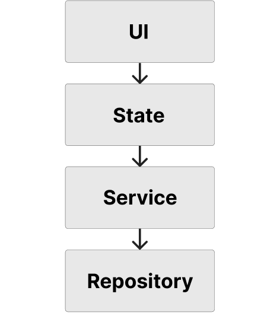

<div align="center">

</div>

# TesTes

Ah, Ah, Testing... Testing...

## Getting Started

```shell
make setup

// When you want to run build runner
make build run

// When you want to run pub get
make pub
```

## Architecture



### UI

ユーザとのインタラクションを担当する

### State

UIの状態管理を担当する

ユーザのアクションに基づいて状態をAsyncValueで更新しUIに通知する

### Service

ビジネスロジックを担当する

Repositoryにデータを渡す際はここで加工する

Serviceは複数Repositoryに依存可能

### Repository

データの永続化を担当する

DBへアクセスを行い、データの読み書きを行う
